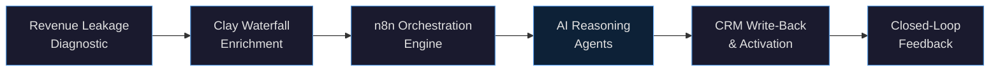

# Sammy Samet
### AI Revenue Automation Architect & Fractional CTO | Principal Technologist, myAutoBots.AI

> I install production-grade agentic revenue systems that recover pipeline, eliminate manual ops, and compound GTM efficiency — deployed in 72 hours, not 6 months.

📍 Beverly Hills, CA &nbsp;·&nbsp; 🌐 [myautobots.ai](https://myautobots.ai) &nbsp;·&nbsp; 📅 [Book a free 30-min discovery call](https://calendly.com/ssam8005/30min) &nbsp;·&nbsp; 💼 [LinkedIn](https://linkedin.com/in/ssamet)

---

## What I Build

The **Neural-GTM Sprint** — a proprietary 72-hour deployment framework that installs a multi-agent revenue automation layer on any B2B sales stack. Every engagement is scoped, fixed-price, and production-grade from Day 1.

---

## Documented Results

| Outcome | Impact | Context |
|---|---|---|
| Pipeline recovery | **$1.4M** recovered from CRM dead leads | B2B SaaS — Waterfall re-engagement |
| Pipeline velocity | **3.1x** improvement in 30 days | n8n multi-agent orchestration |
| Manual ops eliminated | **52 hrs/week** across 15-rep RevOps team | CRM sync + routing automation |
| Enrichment cost reduction | **97%** vs single-provider tools | Clay Waterfall multi-cascade |
| Compliance deployments | **Zero incidents** in regulated environments | Sovereign AI + HITL governance |

---

## Repos

| Repo | What's Inside |
|---|---|
| [🚀 neural-gtm-sprint](https://github.com/ssam8005/neural-gtm-sprint) | Full methodology · SOW templates · discovery framework · gap analysis · anonymized case studies · Mermaid architecture diagrams |
| [⚙️ n8n-revenue-automation](https://github.com/ssam8005/n8n-revenue-automation) | Production workflow library — Clay enrichment waterfall · CRM sync · HITL approval gates · outbound triggers · intent scoring |
| [🧠 agentic-lead-scoring](https://github.com/ssam8005/agentic-lead-scoring) | Python + LangChain + LangGraph + Pinecone · RAG-based lead intelligence engine · stand-alone, production-ready |

---

## Stack

**GTM & Enrichment**

**Automation & Orchestration**

**AI & LLMs**

**Data & Vector**

**CRM**

**Languages & Infra**

---

## Credentials

- **TOGAF 9.2** Certified Enterprise Architect — The Open Group
- **VMware Cloud Transformation** Certified
- **BS Computer Science** — University of Maryland College Park
- 20+ years enterprise technology leadership

---

## Open for Engagements

I work exclusively with **B2B SaaS** companies and **e-commerce businesses** (under $15M ARR) that are ready to stop manually managing their revenue operations.

Not a sales call. We audit your stack together, I identify where revenue is leaking, and we decide if a sprint makes sense.

**→ [Book a free 30-min discovery call](https://calendly.com/ssam8005/30min)**

---

*Principal Technologist & Architect at [myAutoBots.AI](https://myautobots.ai) · Available for remote contract engagements*
